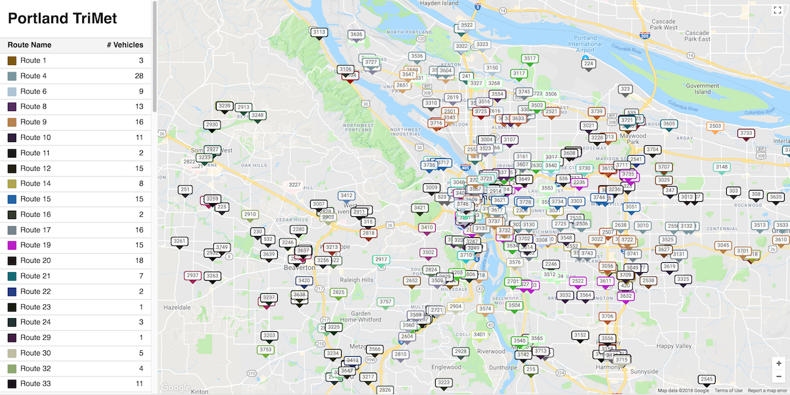

# Bus Tracker

A project to visualize transportation data from the Satori [live transportation API](https://www.satori.com/livedata/channels/transportation), using React and Redux.

This project was bootstrapped with [Create React App](https://github.com/facebookincubator/create-react-app).

For the project to build, **these files must exist with exact filenames**:

* `public/index.html` is the page template;
* `src/index.js` is the JavaScript entry point.

## Installing Dependencies

If you have [Yarn](https://yarnpkg.com/en/) installed, simply enter the following in the project directory:

### `yarn`

Otherwise, using npm:

### `npm install`

## Satori API

To retrieve data, you'll need to get an API key from [Satori](https://www.satori.com/livedata/channels/transportation). Update `RTM_APP_KEY` in `src/constants/index.js` with your key and you should be good to go.

## Starting the App

In the project directory, run:

### `npm start`

Runs the app in the development mode. 
Open [http://localhost:3000](http://localhost:3000) to view it in the browser.

The page will reload if you make edits. 
You will also see any lint errors in the console.
